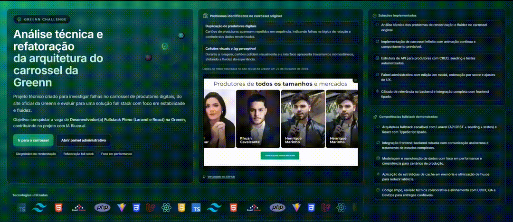
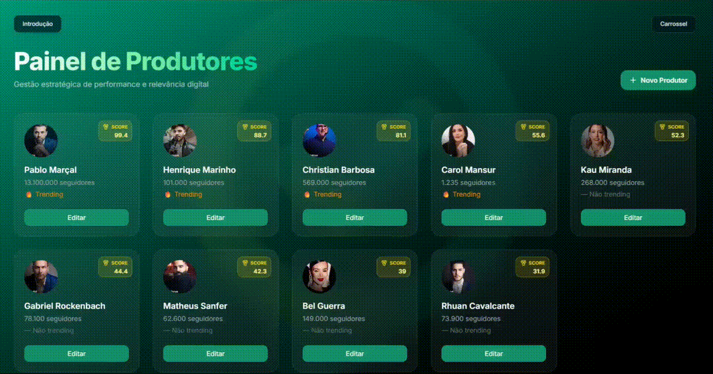

# [Greenn](https://greenn.com.br/) Challenge

<a href="https://greennchallenge.up.railway.app/" target="_blank">
	
</a>
<a href="https://greennchallenge-production.up.railway.app/api/v1/" target="_blank">
	
</a>

## Overview

<p align="center">
	<b>To test the application, simply access the deployed frontend at:<br/>
	<a href="https://greennchallenge.up.railway.app/" target="_blank">https://greennchallenge.up.railway.app/</a></b>
</p>

This repository contains the fullstack technical challenge for Greenn, focused on refactoring and optimizing a carousel component for better rendering, state consistency, and user experience. The project is fully implemented and deployed.

<p align="center">
		<b>Modern, modular, and high-performance fullstack challenge</b><br/>
		
		
		
		
		
		
		
		
</p>

## Key Features

- Animated, infinite carousel with ranking and optimized loading
- Admin panel for producer management (CRUD, search, sort)
- Real-time validation, feedback, and instant UI updates
- Responsive, accessible, and high-performance UI
- Strongly typed, modular, and scalable architecture
- Full integration between frontend and backend

## Visual Highlights

| Page/Feature      | Demo                                                                        |
| ----------------- | --------------------------------------------------------------------------- |
| Intro             |                        |
| Carousel          |                            |
| Admin Panel       |                                  |
| Create Producer   |      |
| Edit Producer     |                  |
| New Producer Flow |  |

## How to Run Locally

### Frontend

```bash
cd frontend
npm install
npm run dev
```

### Backend

```bash
cd backend
composer install
cp .env.example .env
php artisan key:generate
php artisan migrate --seed
php artisan serve
```

## About

This project was developed by Leonardo Florentino Fernandes as a self-proposed technical challenge inspired by the Greenn stack, aiming for the following position: [Fullstack Developer (Laravel & React) at Bluee](https://vagas.solides.com.br/vaga/771877/desenvolvedor28a29-fullstack-pleno-28laravel-e-react29-bluee). The challenge and solution were entirely designed and implemented by the author, not by the company. It demonstrates advanced React rendering, performance optimization, and robust fullstack integration between Laravel and React. Special attention was given to clean, scalable architecture, maintainable code, and a seamless user experience, reflecting production-level standards throughout the application.
