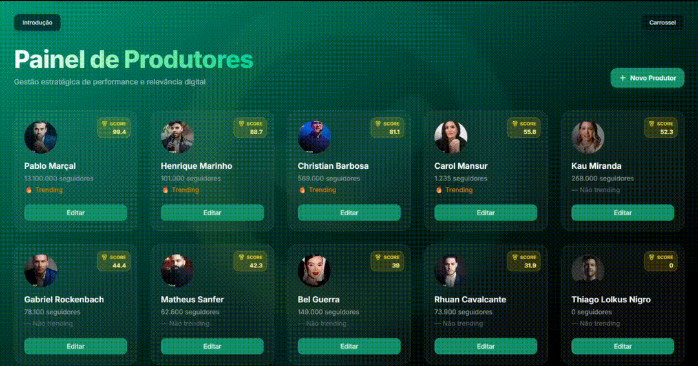
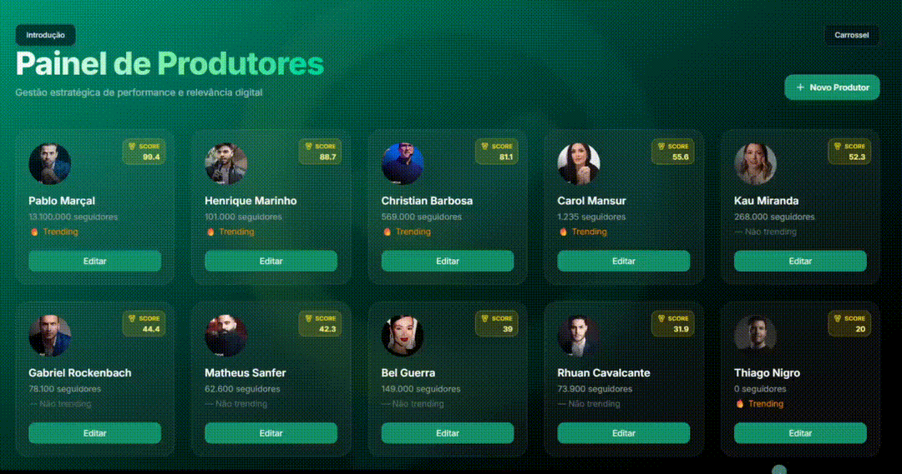

<div align="center">
	
	
	
	
</div>

# Frontend – Green Challenge

<p align="center">
	<b>Interface moderna, modular e performática para gestão de produtores</b><br/>
	
	
	
	
	
</p>

---

## ✨ Características Principais

- **Arquitetura modular:**
  - `components/` – Componentes reutilizáveis (Cards, Carousel, Modal, Toast, etc.)
  - `pages/` – Páginas (Home, Admin, Intro)
  - `services/` – Abstração de API e integração
  - `types/` – Tipos TypeScript fortemente tipados
  - `styles/` – Estilos globais e customização via TailwindCSS
- **UI responsiva e acessível**
- **Animações fluidas e otimizadas**
- **Integração total com backend REST**
- **Validação e feedback visual em tempo real**
- **Estrutura pronta para testes e expansão**

---

## 🗂️ Estrutura de Pastas

```text
src/
	components/   # Componentes reutilizáveis
	pages/        # Páginas principais
	services/     # Serviços de API
	types/        # Tipos TypeScript
	styles/       # Estilos globais
	routes/       # Rotas da aplicação
	App.tsx       # Composição principal
	main.tsx      # Bootstrap do React
```

---

## 🚀 Tecnologias Utilizadas

<table>
	<tr>
		<td align="center"><br/>React</td>
		<td align="center"><br/>TypeScript</td>
		<td align="center"><br/>Vite</td>
		<td align="center"><br/>TailwindCSS</td>
		<td align="center"><br/>React Router</td>
		<td align="center"><br/>Lucide Icons</td>
	</tr>
</table>

---

## 🧪 Testes e Qualidade

- **React Doctor:**
  - Projeto analisado e aprovado pelo [react-doctor](https://github.com/karanpratapsingh/react-doctor)
  - Sem problemas críticos de performance, acessibilidade ou arquitetura detectados
- **ESLint + TypeScript:**
  - Código limpo, padronizado e seguro
- **Estrutura pronta para testes unitários e de integração**

---

## 📦 Scripts Úteis

```bash
# Instalar dependências
npm install

# Rodar em modo desenvolvimento
npm run dev

# Build de produção
npm run build

# Lint do projeto
npm run lint
```

---

## 🖼️ Elementos Visuais

<p align="center">
	
	
	
</p>

---

## 📋 Especificações Técnicas

- React 19.x, TypeScript 5.x, Vite 7.x, TailwindCSS 4.x
- Modularização total dos componentes e páginas
- Tipagem forte em toda a aplicação
- Integração RESTful com backend Laravel
- Animações CSS otimizadas (hardware-accelerated)
- Responsividade mobile-first
- Estrutura de serviços para fácil expansão
- Código validado por ESLint e React Doctor

---

## 👩‍💻 Autoria

Desenvolvido por Leonardo Florentino Fernades para o desafio técnico Greenn.
